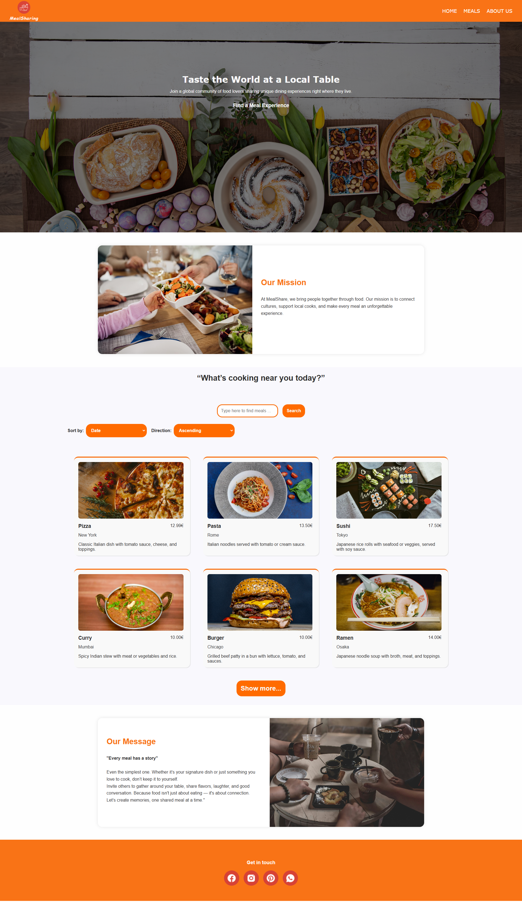
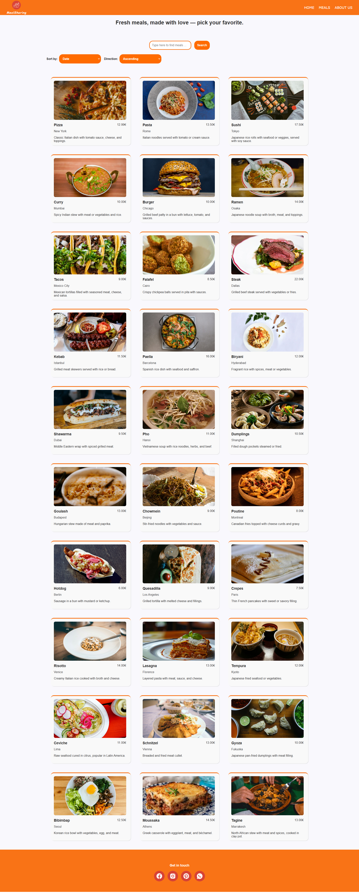
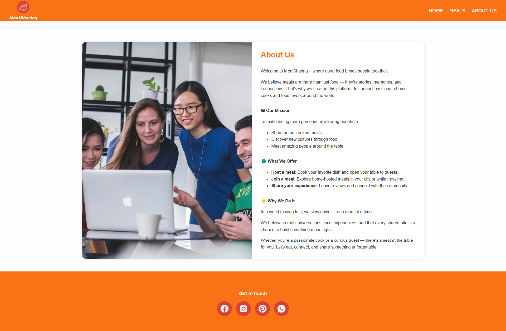
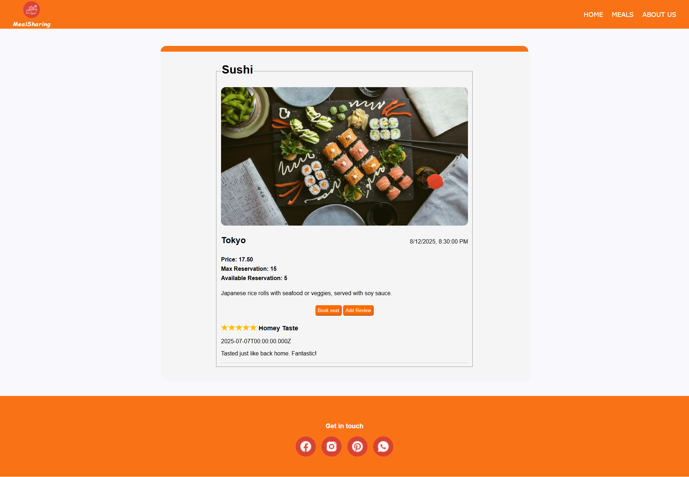
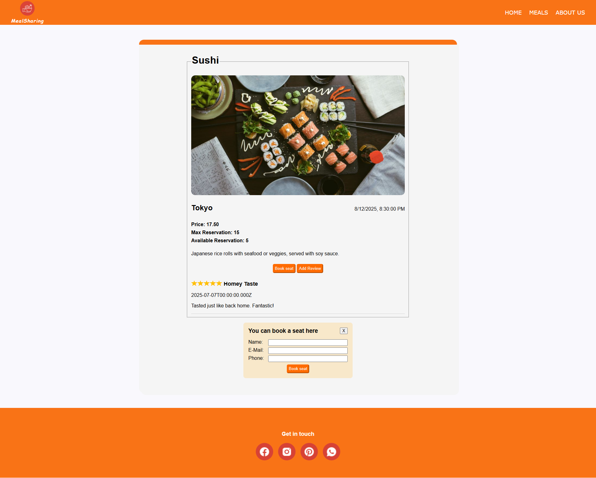
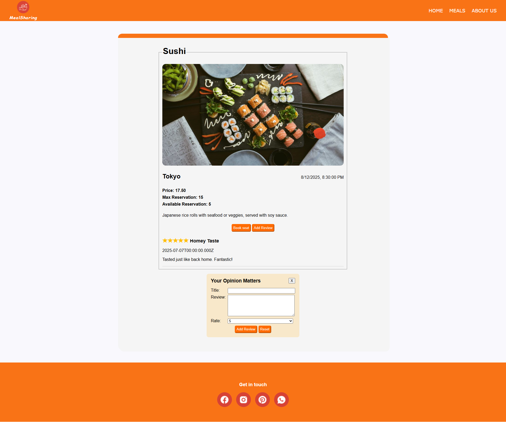

*** MealSharing App ***
MealSharing is a full-stack web application built with React.js and designed to connect people through the joy of food. Users can explore meals offered by hosts, reserve seats, and leave reviews after enjoying their meal experience. The app encourages community bonding, even over the simplest homemade dishes.

*** Features ***
 1.Browse a list of available meals with images and key details

 2.Make reservations with contact information and guest count

 3.Submit reviews with star ratings and feedback

 4.Responsive and clean user interface

 5.Home page with a hero section and welcoming message

 6.Image-driven layout with optimized loading

 7.Semantic and modular CSS for maintainability

*** Technologies Used ***
Frontend: React, JSX, CSS Modules

Backend (assumed): Node.js, SQL-based database

Assets: Images stored in /public/mealPhoto, named by meal ID

 *** Code Highlights ***
🔹 State Management: Used useState to manage local data (meals, forms, etc.)

🔹 Data Fetching: Used useEffect for API calls and synchronizing frontend with backend

🔹 Component Design: Reusable and focused components like MealCard, ReviewForm, and ReservationForm

🔹 Dynamic Images: Automatically load image from /mealPhoto/{id}.jpg for each meal

🔹 Form Handling: Collect user input for reservations and reviews with validation

🔹 Visual Feedback: Star-based visual review system

. Meal Images
Each meal has an image located in the public/mealPhoto/ folder. Image files are named after the meal’s ID (e.g., 1.jpg, 2.jpg). This enables dynamic loading of the correct image for each meal card.

. User Message Example
“Sharing food is about more than eating—it’s about connection. Whether it’s a homemade soup or a full-course dinner, invite others to your table and make memories together.”

*** Future Improvements ***
User authentication (login/signup)

Admin panel to manage meals and reviews

Pagination or infinite scroll for meal list

Image upload support for new meals

Filter meals by location or cuisine

*** Developer ***
Created by [Your Name], Junior Frontend Developer.
This project was developed as a final assignment for a React course, through this project, I learned to think in components, manage state effectively, fetch and sync backend data, and handle user interaction. The use of useState and useEffect gave me confidence in building dynamic, interactive user interfaces.

I’m excited to keep improving this app and continue learning best practices from your feedback!
Let me know if you'd like a version formatted for Google Docs, Markdown, or PDF export.

**The screenshots of Meal Sharing **

